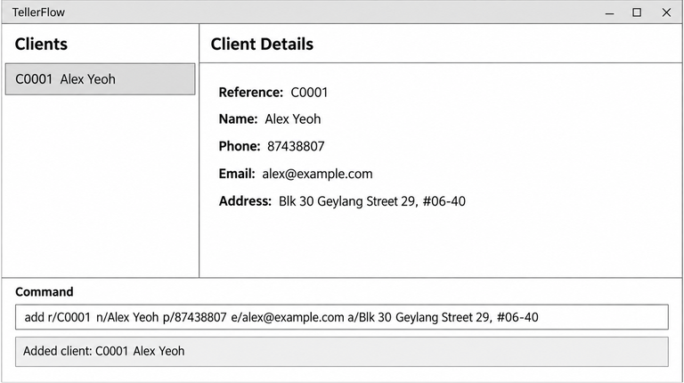

# TellerFlow

**TellerFlow is a desktop application for managing contacts.** It combines a graphical interface with a command-line interface so that users who prefer typing can manage their contacts efficiently.

Key characteristics:

* Optimized for fast, keyboard-driven use.
* Provides a graphical overview of stored contacts.
* Stores data locally and saves changes automatically.
* Built with Java and JavaFX.

For more information:

* See the [User Guide](docs/UserGuide.md) for instructions on using the application.
* See the [Developer Guide](docs/DeveloperGuide.md) for information about the design and implementation.

## Acknowledgements

This project is based on the AddressBook-Level3 project created by the [SE-EDU initiative](https://se-education.org).
